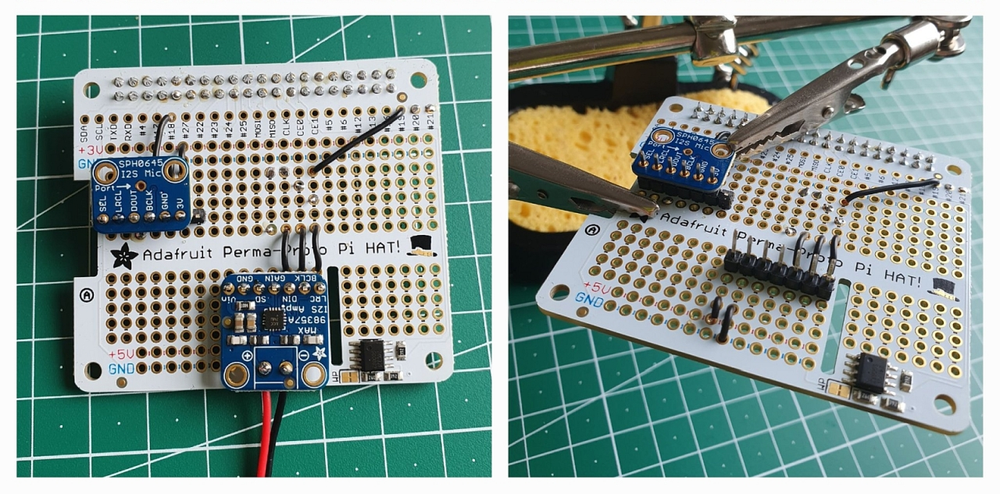

# Proto Voice HAT

A custom, DIY voice HAT prototype for Raspberry Pi, built with commonly available parts like Adafruit and SparkFun breakout boards etc.  
V1 has a single microphone, a 3W amp for audio output and a RGB LED to indicate different states.




# Parts

## HAT and Breakout Boards

- [Adafruit Perma-Proto HAT for Pi Mini Kit - With EEPROM](https://github.com/adafruit/Adafruit-Perma-Proto-HAT-PCB) (w/o EEPROM should work as well, see below)
- [Adafruit I2S MEMS Microphone Breakout](https://learn.adafruit.com/adafruit-i2s-mems-microphone-breakout)
- [Adafruit MAX98357 I2S Class-D Mono Amp](https://learn.adafruit.com/adafruit-max98357-i2s-class-d-mono-amp)
- [SparkFun WS2812B RGB LED Breakout](https://github.com/sparkfun/WS2812_Breakout)
- TODO: Button

## Additional Parts

- 3 resistors 47k, 10k and 330 Ohm
  - 330 Ohm: Between GPIO10 and D_in of the LED to improve signal quality and protect the data PIN
  - 10k and 47k Ohm: 47k between GPIO16 and SD of the amp and 10k between amp SD and ground PIN. This forms a voltage divider that controls the amp.
- Optional 100nF capacitor
  - Used between 3v power supply and GND of the mic. Supposed to clean up high frequency noise coming from the power supply.
- Speaker recommendation
  - 6.5 cm full-range speaker, 130–20000 Hz, 5W, 4 Ohm impedance, for example: [Visaton FR 7](https://www.visaton.de/en/products/drivers/fullrange-systems/fr-7-4-ohm)


# Build

## Soldering the Parts

Please check out the [soldering-steps](./soldering-steps) folder to learn how you can put all parts together.

# Software Installation

This section describes how to get the Proto Voice HAT working on your Raspberry Pi.
If you have an Adafruit Proto HAT with EEPROM, I recommend to install the EEPROM tools to flash it once. This way the HAT will be recognized automatically by the OS.  
If you want to skip the EEPROM for testing, see step 1b.

## 1a. Setup with EEPROM

Install the required packages to build the EEPROM tools, create the EEPROM data and flash it:
- `sudo apt install build-essential cmake i2c-tools device-tree-compiler`

### EEPROM

IMPORTANT: Before you try to flash the EEPROM make sure the write-protect PIN next to the EEPROM (labeled WP) is grounded. It should be by default.  
  
Build the [EEPROM utils]((./eepromutils)):
- `cd eepromutils`
- `bash build.sh`

Use the prepared files to build your EEPROM image:
- `cd ../drivers`
- `../eepromutils/eepmake -v1 eeprom_settings.txt custom_voice_hat.eep aiy_hat.dtbo`
NOTE: we attach the AIY-HAT overlay directly to the EEPROM image. See section 1b if this leads to errors on future RPis.

Backup the original EEPROM (optional, but a good connection test as well):
- `sudo ../eepromutils/eepflash.sh -r -f=my_backup.eep -t=24c32`

Write the new EEPROM:
- `sudo ../eepromutils/eepflash.sh -w -f=custom_voice_hat.eep -t=24c32`

If everything looked OK, go to step 2 now and modify your boot config.txt before reboot.

### If your dtoverlay breaks

If you need to create a new .dtbo file from a modified .dts, you can use this command:
- `dtc -@ -I dts -O dtb -o my-new.dtbo my-new.dts`

## 1b. Setup without EEPROM

To use the Proto Voice HAT without the EEPROM you need to modify the boot config.txt of your Raspberry Pi to load the drivers and settings.  

### modify your /boot/config.txt

At the very start you can add this, to make sure no EEPROM will be loaded (if you have no EEPROM skip it):
```
# Ignore EEPROM at boot
force_eeprom_read=0
```

Further down, add this:

```
# Enable I2S
dtparam=i2s=on

# Enable SPI (for RGB LED at GPIO 10)
dtparam=spi=on

# Enable Google AIY soundcard
dtoverlay=googlevoicehat-soundcard

# Amp on/off (GPIO 16 to output)
gpio=16=op,dl

# Push button (GPIO 23 to input, may be 'pd' instead of 'pu', depending on your setup)
gpio=23=ip,pu

# I2S Pins (18, 19, 20, 21) will likely be set automatically from googlevoicehat overlay to ALT0, if not:
gpio=18,19,20,21=a0
```

## 2. General tweaks/fixes for the /boot/config.txt

Some modifications to the default confix.txt that usually work well on Raspberry Pi 4.
Note that this assumes you are using a sound only via the custom HAT.

```
# Enable SPI for the LED
dtparam=spi=on

# Disable on-board audio
dtparam=audio=off

# Disable HDMI audio
dtoverlay=vc4-kms-v3d,noaudio

# LED SPI frequency fix (NOTE: you can try 250 or 400 on Pi4/5 models)
core_freq_min=500
```

## 3. ALSA setup via asound.config

Please check out the [alsa-config](./alsa-config) folder and make sure to copy the config to your user space!

Set the volume with:
- `alsamixer`

To test your settings use:
- `arecord -D default -r 16000 -f S16_LE -c 1 -t wav -d 10 test.wav`
- `aplay -D default test.wav`

## 4. LED Controls

Please see the [GPIO item for CLEXI](https://github.com/bytemind-de/nodejs-client-extension-interface/blob/dev/gpio_items/rpi-spi-rgb-leds.js) for a Node.js example.

## 5. Raspberry Pi SEPIA Client

Please see the official [RPi SEPIA Client docs](https://github.com/SEPIA-Framework/sepia-installation-and-setup/tree/master/sepia-client-installation/rpi#2a-sepia-client-installation).


# Resources and Credits

- [custom-voice-hat](https://github.com/shivasiddharth/custom-voice-hat) by by shivasiddharth - Foundation for this project
- [Embedded Linux Wiki](https://elinux.org/RPi_BCM2711_GPIOs#PWM1_0) (elinux.org) - Useful Raspberry Pi GPIO pin info

## Google AIY Voice HAT

The original AIY voice HAT by Google was used as reference to build the custom voice HAT. We can study the schematics to learn some tricks :-)
- [Voice HAT mic and board schematics](https://github.com/google/aiyprojects-raspbian/tree/aiyprojects/schematics/voice_hat)
- [Driver support for Google voice HAT soundcard](https://github.com/raspberrypi/linux/pull/1923/files) (Raspberry Pi Linux commit)

Latest versions of the Google voice HAT overlay files (might be useful for EEPROM):
- [.dtbo file for voiceHAT overlay](https://github.com/raspberrypi/firmware/blob/master/boot/overlays/googlevoicehat-soundcard.dtbo) (Official RPi firmware)
- [.dts file for overlay](https://github.com/raspberrypi/linux/blob/rpi-6.12.y/arch/arm/boot/dts/overlays/googlevoicehat-soundcard-overlay.dts) (Kernel 6.12)
