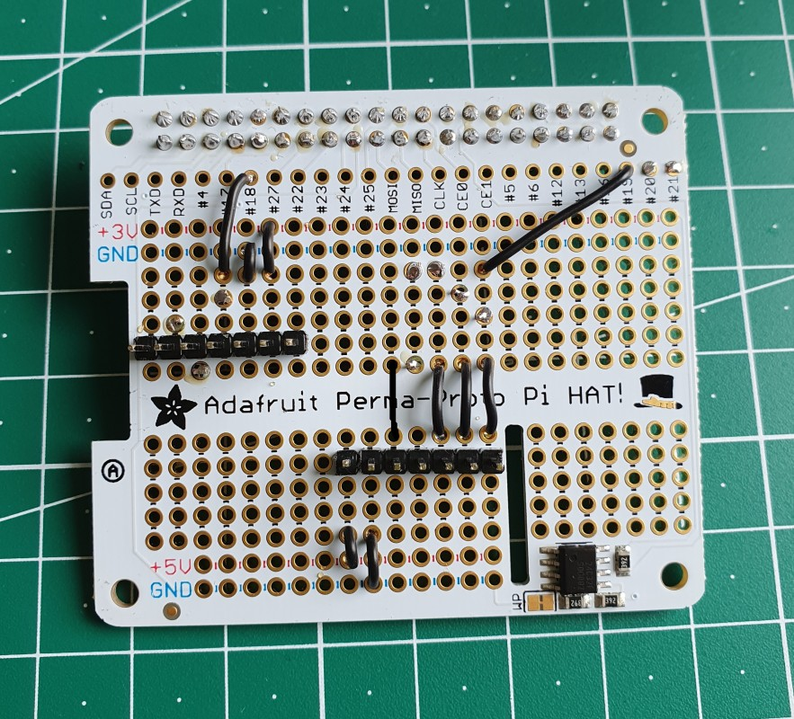
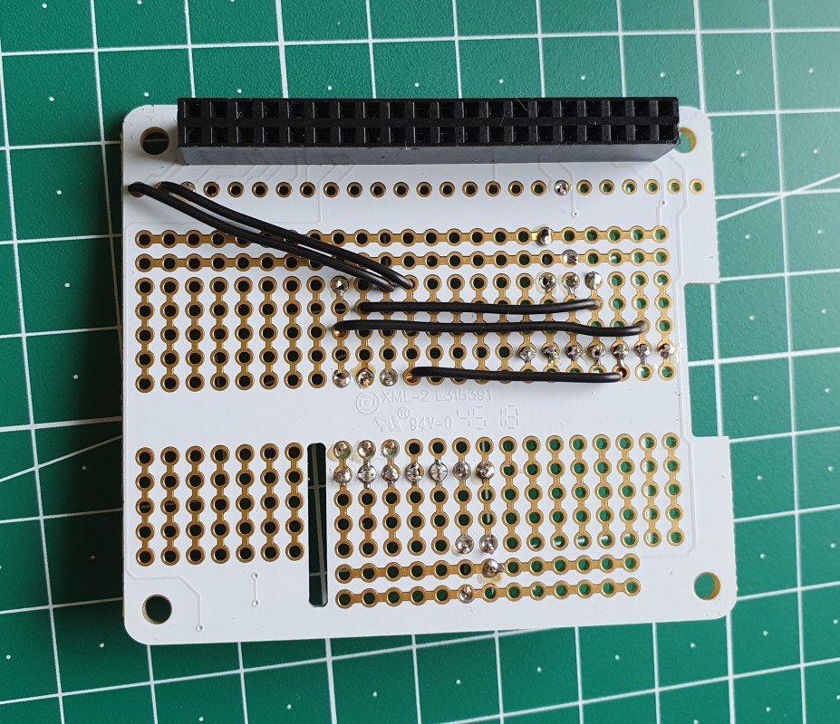
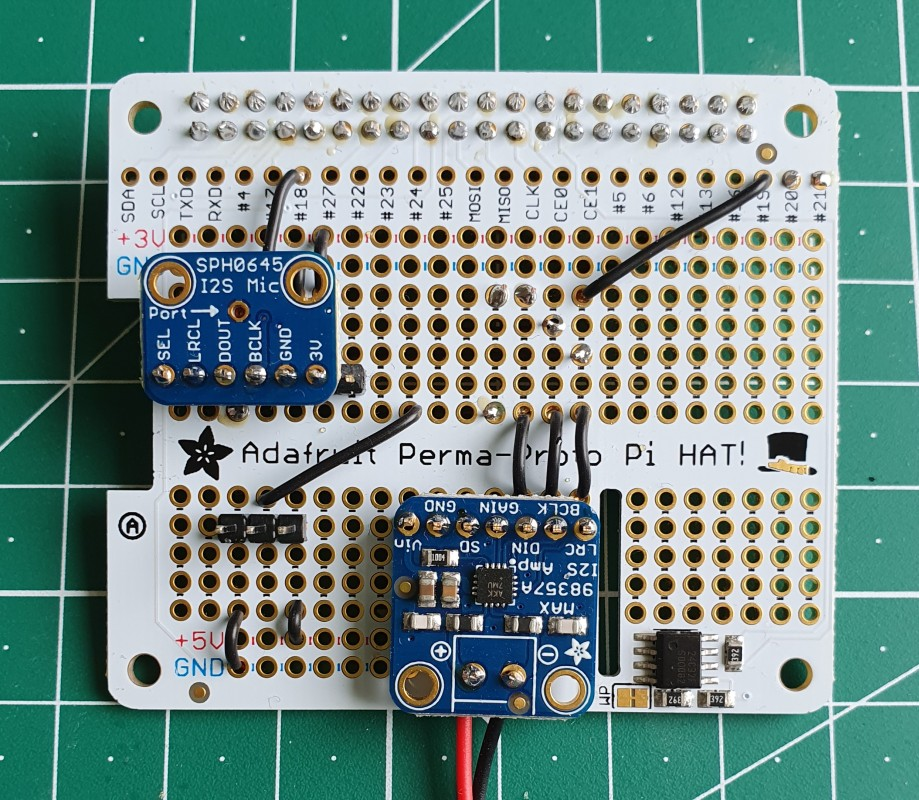
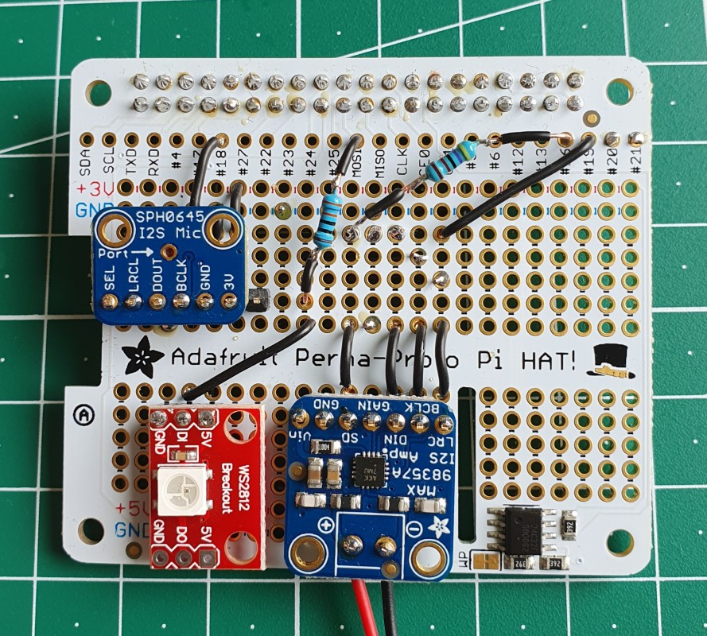
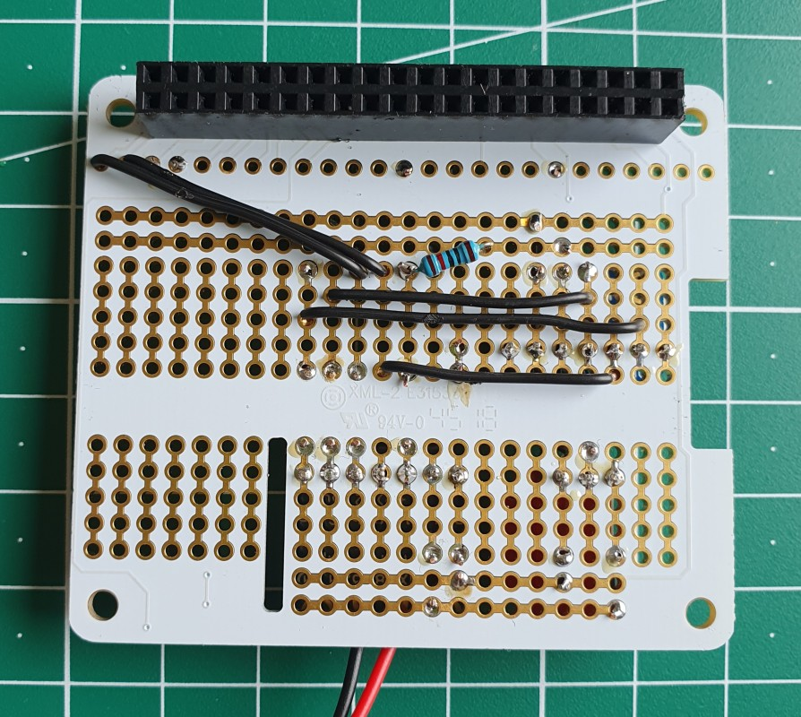

# Soldering the Proto Voice HAT

## Connections

There are many different ways to place the parts on top of the Proto HAT, but these are the connections you need to establish, to make it work.
  
### Adafruit MAX98357 I2S Class-D Mono Amp

- Vin to 5V
- GND to GND
- SD splits into (see amp docs for details, basically its a voltage divider that controls the channel and prevents nasty sounds on power up):
  - SD - 47k Ohm resistor - GPIO16
  - SD - 10k Ohm resistor - GND
- GAIN is not used
- Din to GPIO21
- BCLK to GPIO18
- LRC to GPIO19

### Adafruit I2S MEMS Microphone Breakout

- SEL is not used (for mono mic)
- LRCL to GPIO19
- Dout to GPIO20
- BCLK to GPIO18
- GND to GND
- 3V to 3V
- Optional: connect 3V and GND right at the breakout with a 100nF capacitor to filter high-freq. noise from power signal

### SparkFun WS2812B RGB LED Breakout

- GND to GND
- Di to GPIO10 (MOSI)
  - Use a 330 Ohm resistor in between to improve signal quality and protect the data PIN (might also be required to get the correct control signals)
- 5V to 5V

## Image series

Here is my recommendation of how to solder the HAT step by step:

    
    
	
	
    

